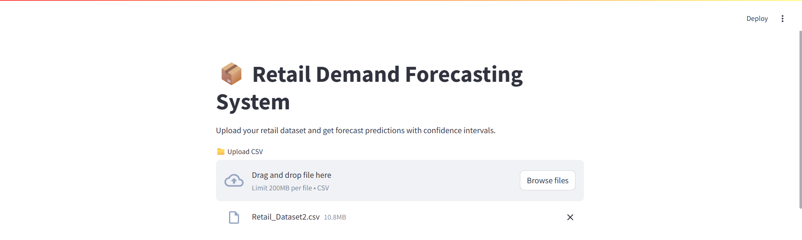
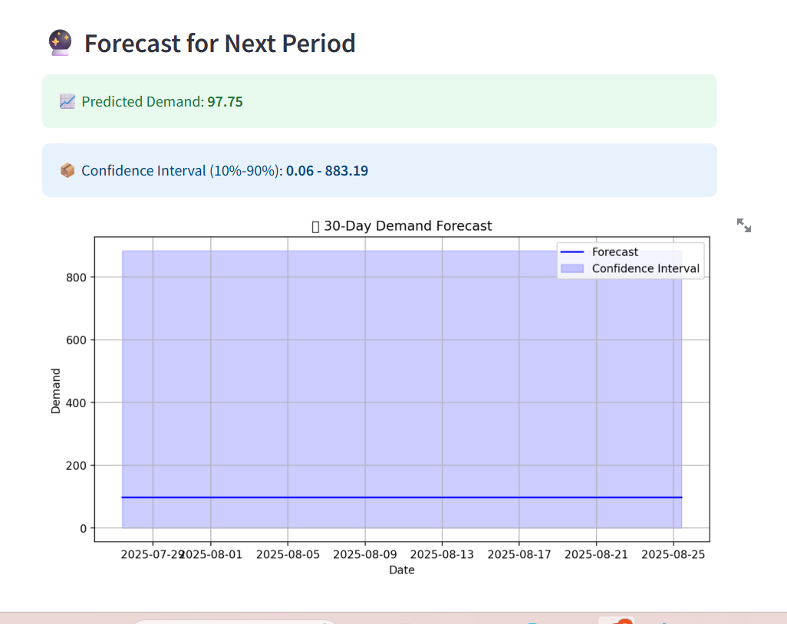

# Create a README.md file with the updated content and save it for download
📦 Retail Demand Forecasting System



A production-ready demand forecasting system that uses **CatBoost** regression models with **quantile estimation** to predict future order demand, including **confidence intervals** (10% - 90%). Integrated with **MLflow** for experiment tracking, **DVC** for data & model versioning, and **DagsHub** for full reproducibility and collaboration.

---

## 🚀 Key Features

- 📈 Predict retail demand using historical sales data
- 🎯 Confidence intervals using quantile regression (10th and 90th percentiles)
- 🧠 Automated feature engineering (lags, rolling means, SMAs, EMAs)
- 🧪 Time series-based train/test split
- 📊 Model performance metrics: R², MAE, RMSE, Interval Coverage
- 🌐 Streamlit UI for uploading CSVs and getting instant forecasts
- 🛠 Modular ML pipeline with data ingestion, transformation, training, and inference
- 🔁 **MLflow** tracking for parameters, metrics, artifacts
- 📦 **DVC** for data/model versioning
- 🌍 **DagsHub** integration for seamless collaboration & experiment reproducibility

---

## 📊 Example Forecast Output

| Metric | Value |
|--------|--------|
| **MAE** | `2046.80` |
| **RMSE** | `17983.73` |
| **R² Score** | `0.8595` |
| **Interval Coverage (10%-90%)** | `79.85%` |

---

## 🧪 Data & Feature Engineering

Features created from the input `Date` and `Order_Demand`:

- `lag_1`, `lag_7`
- `rolling_mean_3`, `rolling_mean_7`, `rolling_std_7`
- `sma_7`, `sma_14` (Simple Moving Averages)
- `ema_7`, `ema_14` (Exponential Moving Averages)
- Date-based features: `year`, `month`, `day`, `dayofweek`, `is_weekend`

---

## 📈 Experiment Tracking with MLflow

- All experiments (parameters, metrics, models) are tracked via **MLflow**.
- Logs are versioned and pushed to **DagsHub MLflow remote tracking URI**.
- Visualize and compare runs on the DagsHub experiment dashboard.

---

## 📦 Data & Model Versioning with DVC

- Dataset and model files are versioned using **DVC**.
- Remote DVC storage is connected to **DagsHub**, enabling collaborative workflows.
- Reproduce any experiment using `dvc repro` and ensure consistency across runs.

---

## 🌍 DagsHub Integration

Project hosted on:  
🔗 [**DagsHub Repository**](https://dagshub.com/bhaveshnikam09/retail-demand-forecasting)

Features:
- Git + DVC sync
- Remote MLflow experiment tracking
- Dataset previews and pipelines visualization

---

## 💻 Streamlit UI

- Upload a `.csv` file
- Visualize the forecast chart
- Download the forecast with intervals

> Example UI:



---

## 🛠 How to Run Locally

1. **Clone the Repo**
   ```bash
   git clone https://github.com/bhaveshnikam09/retail-demand-forecasting.git
   cd retail-demand-forecasting
